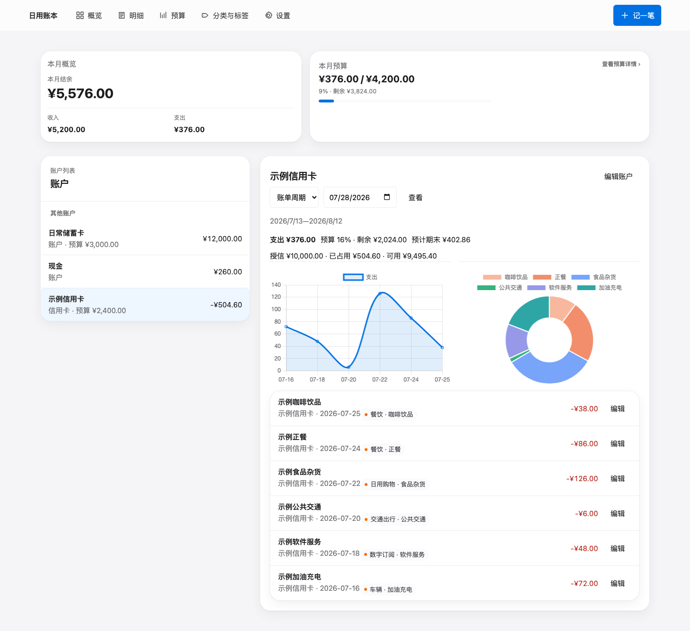

# Agent Ledger

[English](README.md) | [简体中文](README.zh-CN.md)

Agent Ledger 是一个面向 AI Agent 记账场景的自托管个人财务系统，由 Flask 后端、SQLite 数据库和静态 Web 界面组成。账本数据和 API 密钥都保存在你自己掌控的设备或服务器上，适合部署在 NAS、VPS 或其他个人服务器中。

我做这个记账本，最初只是想更认真地了解自己的现金流。恰好赶上 Vibe Coding 兴起，也让我这样没有技术背景的人，有机会把一个长期停留在脑海里的想法真正做出来。

市面上已经有很多成熟的开源或商业记账软件。相比之下，Agent Ledger 目前仍然很朴素，但它有一个对我来说很实用的特点：可以通过 API 与 AI Agent 配合使用。

将 Agent 接入微信、Telegram 等聊天工具后，你可以只发一句话，或者丢一张消费截图，由 Agent 提取记账信息，再调用接口写入账本，不必每次打开应用逐项填写。

这类操作流程比较短，单次记账通常只需要少量模型调用。Agent Ledger 本身不绑定特定模型、Agent 或聊天平台，你可以根据自己的部署环境自由组合。

> **早期项目。** 在依赖记录之前，请先检查交易内容。本项目不是银行，不提供银行级安全保证，也不保证自动分类完全准确，不适用于企业财务管理。



截图中的账户、交易、金额和预算均为完全虚构的演示数据。

## 快速开始

当前版本已使用 Python 3.9.6 完成验证。其他 Python 版本尚未经过系统性测试。前端测试需要 Node.js，下面的 API 示例还需要带有 `curl` 的 shell 环境。

在仓库根目录执行：

```bash
python3 -m venv .venv
.venv/bin/pip install -r requirements.txt
export FINANCE_API_PORT=5009
export FINANCE_DB_PATH="$PWD/runtime/agent-ledger.db"
export FINANCE_API_KEY='replace-this-with-a-long-random-secret'
.venv/bin/python release/app/main.py
```

打开 <http://127.0.0.1:5009>，然后在 **Settings** 中输入同一个 API key。首次启动时，应用会在 `runtime/agent-ledger.db` 创建 SQLite 数据库。

验证安装：

```bash
PYTHON_BIN=.venv/bin/python bash release/scripts/verify-release.sh
```

## 核心功能

- 账户、交易、余额、预算、分类、标签和 CSV 导出。
- 信用卡账期、还款记录和预算周期视图。
- 可重复的分类规则，以及可编辑的分类/标签种子数据。
- 面向本地自动化和 AI Agent 工作流的小型认证 JSON API。

## Web 界面

Web 界面可用于录入或修正交易、检查分类建议、管理账户和预算、查看汇总信息以及导出账本。当前界面主要使用简体中文。浏览器只会把 API 地址和 API key 保存在本地浏览器存储中；仓库不会向界面预置远程端点或密钥。

## AI Agent 接入

Agent 应调用经过认证的本地 API，而不是直接读写 SQLite 文件。只授予 Agent 完成任务所需的最小权限，使用专用的本地 API key，并要求人工复核不明确或金额较高的交易。

例如，Agent 可以先获取当前分类体系：

```bash
curl -sS \
  -H "X-API-Key: $FINANCE_API_KEY" \
  http://127.0.0.1:5009/taxonomy
```

之后，Agent 可以使用 API 返回的分类、标签和账户 ID，通过 `POST /transactions` 创建交易。支持的字段和示例见 `release/app/routes.py` 中的请求校验以及 `tests/` 中的 API 测试。

Hermes 可以作为外部 Agent 工作流的参考集成，但不是运行 Agent Ledger 的必需依赖。本仓库不包含 Hermes 配置、凭证、部署记录或私人工作流。

## 环境变量

| 变量 | 是否必需 | 说明 |
| --- | --- | --- |
| `FINANCE_API_KEY` | 是 | 认证 API 端点所需的长随机密钥。 |
| `FINANCE_DB_PATH` | 显式部署时必需 | SQLite 数据库路径。默认使用项目下的 `runtime/agent-ledger.db`。 |
| `FINANCE_API_PORT` | 否 | HTTP 端口，默认值为 `5009`。 |

仓库中的 `.env.example` 只是配置模板。当前应用不会自动加载 `.env`；请在 shell 中导出这些变量，或通过进程管理器配置。不要提交真实的 `.env` 文件。

## 测试与检查

```bash
PYTHON_BIN=.venv/bin/python bash release/scripts/verify-release.sh
```

该命令会运行完整 Python 测试、Node 前端测试、Python 编译检查和前端静态检查。

## 数据与备份

`runtime/` 是默认的本地数据目录，并已被 Git 忽略。长期部署时，请将其放在持久化存储中。定期把 SQLite 数据库备份到独立且受访问控制的位置；在依赖备份之前先测试恢复流程。不要把数据库、交易导出、备份、截图或运行日志提交、发布或上传到 issue。

升级、迁移、修改数据库结构或更换应用/镜像前，必须先在私有且受访问控制的位置备份 SQLite 数据库和部署配置。确认备份可以恢复后再继续，并且绝不要把 `.env` 或其中的密钥放入 Git。

## 隐私与安全

Agent Ledger 的设计目标是让财务记录保留在本地，但这并不能消除运行风险。请保护 API key，限制网络暴露范围，确保数据库目录为私有，并检查 Agent 创建的交易。请参阅 [SECURITY.md](SECURITY.md) 和[部署指南](docs/DEPLOYMENT.md)。

## 当前限制

- 自动分类只是基于规则的辅助功能，不保证结果正确。
- SQLite 适合单个可信操作人或规模适中的本地使用，不是多租户会计服务。
- 项目不提供云端部署、Docker 镜像或银行同步，也不依赖 Hermes。
- 本项目仍处于早期阶段，请谨慎对待导出、迁移和 Agent 自动化操作。

## 致谢

Agent Ledger 的部分视觉设计 token 改编自 naplesblue 的
[apple-design-skill](https://github.com/naplesblue/apple-design-skill)，
并依据 MIT License 使用。

许可与版权详情见 [THIRD_PARTY_NOTICES.md](THIRD_PARTY_NOTICES.md)。
